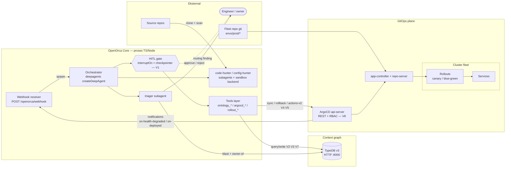
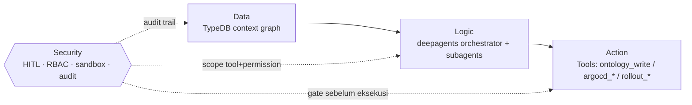
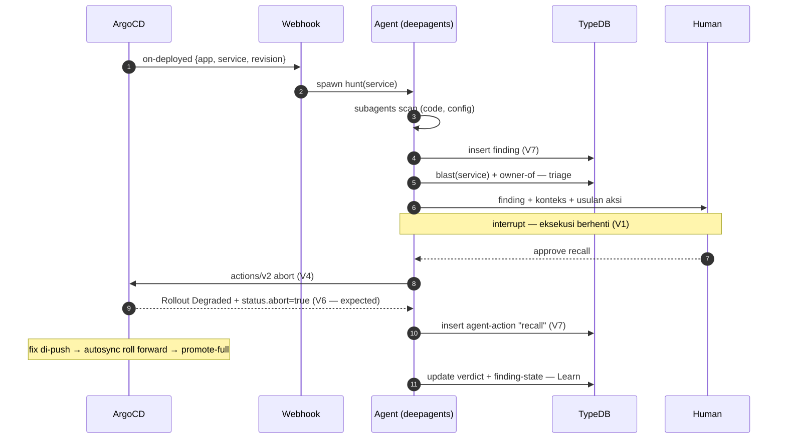

# ARCHITECTURE — OpenOrca (high level)

Kontrak: [SPEC.md](SPEC.md). Detail per-domain: `context/kits/`. Rujukan invariant `V*` = SPEC §V.

## Komponen

## Peran komponen

| Komponen | Peran | Kit |
|---|---|---|
| Orchestrator (deepagents) | Loop agent utama; spawn subagents; semua aksi lewat tools | kit-agent-tools |
| Hunter subagents | Detect: scan source (sandbox `execute`), config, boundary | kit-agent-tools |
| Triager subagent | Validate: exploitability via fungsi graph (`blast`, `owner-of`) | kit-ontology |
| HITL gate | ∀ aksi destruktif tertahan sampai approval manusia (V1) | kit-agent-tools |
| TypeDB | Context graph + audit trail primer (V7); reasoning = TypeQL functions | kit-ontology |
| ArgoCD api-server | Satu-satunya jalur kontrol fleet (V8); RBAC machine account | kit-fleet |
| ApplicationSet | 1 Application per service per cluster (V10) | kit-fleet |
| Rollouts | Recall (`abort`) / roll-forward (`promote-full`) / soak (analysis) | kit-fleet |
| Webhook receiver | Eventing masuk: notifications ArgoCD → spawn agent | kit-fleet |

## Layer: Data → Logic → Action → Security

Cara baca lain atas komponen yang sama di atas — per tanggung-jawab, bukan per proses.

| Layer | Isi | Kit |
|---|---|---|
| **Data** | Schema graph (entity/relation), finding, audit trail, evidence | kit-ontology |
| **Logic** | Orchestrator + subagents (Hunt/Challenge/Triage); reasoning TypeQL (`blast`, `owner-of`) jalan *di dalam* Data layer, bukan di Logic | kit-agent-tools, kit-workflow |
| **Action** | Tools yang mengubah state eksternal: `ontology_write`, `argocd_sync/rollback`, `rollout_recall/promote` | kit-agent-tools, kit-fleet |
| **Security** | HITL gate (V1), RBAC machine account (V8), sandbox isolasi (V13/V18), permissions per-subagent, checkpointer durable (V19) | kit-agent-tools, kit-sandboxes |

**Catatan jujur**: Security ⊥ murni tahap terakhir yang jalan setelah Action — dia **mengontrol** ketiga layer lain sepanjang alur: gate HITL berhenti tool call **sebelum** Action tereksekusi (bukan review sesudahnya), sandbox+permissions membatasi apa yang Logic *bisa* coba dari awal, RBAC membatasi Action yang boleh dipanggil, dan audit trail (Data) mencatat semuanya sesudahnya. Diagram di atas urutan Data→Logic→Action linear (tiap output jadi input berikut), Security digambar sbg governing layer yang membungkus, bukan node ke-4 yang sequential.

## Loop → alur runtime

## Trust boundaries

- **Manusia ↔ agent**: aksi destruktif ⊥ jalan tanpa resume eksplisit (V1). Checkpointer = state gate, bukan sekadar log.
- **Agent ↔ cluster**: hanya via ArgoCD REST + token machine account scoped project `openorca` (V8); ⊥ kubeconfig di proses agent.
- **Agent ↔ source**: hunter jalan di sandbox backend; permissions di-scope `CompositeBackend`.
- **Eventing masuk**: webhook diverifikasi `X-OpenOrca-Secret`; payload = data, ⊥ instruksi.

## Deployment view

- Dev: 1 proses Node lokal + TypeDB docker + kind (OO-001).
- Prod: ? — belum diputuskan (grill): OpenOrca sebagai service di cluster sendiri vs eksternal. Konsekuensi: reachability webhook + penyimpanan checkpointer.
