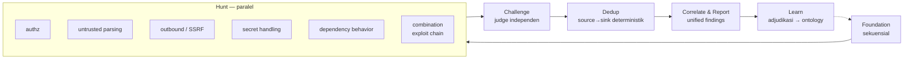

# kit-workflow — pipeline analisis security (code-review)

Cites: SPEC §V1, §V7, §V9, §V11–V16. Kit turunan dari 5 insight (`context/refs/principles.md`) + desain workflow analisis security. Grounding deepagents: `context/refs/research/deepagents_capabilities.md` (subagents, async parallel, examples).

Orchestrator = **deepagents** (teks sumber mengosongkan nama komponen). Workflow = code-review + security-analysis dipecah jadi stage sekuensial & paralel → naikkan coverage, tantang finding lemah, hasilkan finding terstruktur ber-bukti.

## Pipeline



Gate antar-stage = invariant. ∀ stage: akses data/tools ter-governance (least privilege, §Access).

## Foundation (sekuensial) — §T13, V11

Agent memetakan target: repo, dependencies, interfaces, jalur autentikasi, konteks deploy, material desain. Output: **threat model awal + attack surface**. Ditulis ke graph (`service`, `dependency`, `deployment`, trust boundary sebagai `impact`/relation). Hunt ⊥ jalan sebelum output ini ada (V11).

## Hunt (paralel) — §T8, V13

Subagents spesialis jalan paralel, tiap satu tools+permissions ter-scope (V13, least privilege):

```
agent            | fokus                                  | akses (scoped)
authz            | jalur keputusan otorisasi              | source + auth config
untrusted-parse  | parsing input tak-terpercaya           | source + entry points
outbound         | outbound request / SSRF                | source + network config
secrets          | penanganan secret                      | source + ref secret (⊥ nilai)
deps             | perilaku dependency                    | dependency info + threat intel
combination      | gabung kelemahan modest → exploit path | findings agent lain (baca graph)
```

`combination` = agent yang menyelidiki bagaimana kelemahan kecil individual bergabung lintas komponen → jalur exploit lebih luas. Baca finding agent lain dari graph, ⊥ scan ulang.

## Challenge / Validate — §T14, V12

Agent **hypothesis** (Hunt) hasilkan dugaan; orchestrator koordinasi stage validasi & challenge independen yang bertujuan **membantah atau menyaring** dugaan.

- **Judge agent terpisah**, beroperasi **independen dari sesi analisis asal** → di deepagents = `SubAgent` mode isolated/**handoff** (BUKAN `ForkedSubAgent` yang mewarisi history) → hindari confirmation bias. Judge menantang bukti, menilai exploitability, memvalidasi finding sebelum masuk report (V12).
- Bukti tiap finding dipreservasi & bisa direview/ditantang oleh: agent lain, security engineer, atau product owner.
- Isolated execution environment tersedia utk uji PoC / uji fix sebelum finding divalidasi.

## Dedup deterministik — §T14, V14

Semantic similarity saja ⊥ konsisten. ∴ bandingkan **source-to-sink path** tiap finding: bagaimana input tak-terpercaya bergerak dari entry point → operasi yang menciptakan risiko. Path sama → root cause sama → collapse; path beda → vuln distinct.

Model di graph: `finding` owns `entry-point`, `sink`, `exploit-path`. Dedup = deterministik (bukan embedding):

```typeql
# tandai duplikat: entry-point + sink sama → korelasi (canonical = id terkecil)
match
  $a isa finding, has entry-point $e, has sink $s, has id $ida;
  $b isa finding, has entry-point $e, has sink $s, has id $idb;
  $ida < $idb;
insert (canonical: $a, duplicate: $b) isa correlation;
```

## Correlate & Report — §T15

Orchestrator: korelasi raw flags → filter kemungkinan false positive → validasi exploitability → **collapse kelemahan terkait jadi unified findings**. Tiap unified finding: `exploit-path` terdokumentasi, `severity`, weakness mapping (`cwe-id`), `remediation` guidance.

## Learn — §T11, V15

Keputusan & adjudikasi analyst → ditangkap di context graph sebagai pengetahuan organisasi terstruktur → run agent berikutnya: incorporate kesimpulan sebelumnya, **hindari re-surface finding yang sudah di-dismiss**, tingkatkan fidelity deteksi.

```typeql
# suppression: finding open yang root-cause-nya cocok finding dismissed → jangan route (V15)
match
  $f isa finding, has finding-state "open", has entry-point $e, has sink $s;
  $d isa finding, has entry-point $e, has sink $s;
  { $d has verdict "false-positive"; } or { $d has finding-state "dismissed"; };
fetch { "suppress": $f.id };
```

## Model diversity & coverage — §T16, V16

Model = satu bagian sistem; ⊥ ada model/run tunggal yang beri coverage lengkap.

- Model berbeda menemukan attack surface / kelas vuln / isu kritis berbeda di workflow sama. Bervariasi di: refusal behavior, duplicate rate, kalibrasi severity, cost, runtime, kemampuan menuntaskan attack chain panjang. Model baru ⊥ selalu lebih baik; model lama bisa tetap lebih efektif utk workflow/kelas tertentu.
- Run berulang model sama pun bervariasi (agentic = probabilistik). 1 analisis sukses ⊥ bukti coverage lengkap.
- ∴ orchestrator dukung: eksekusi berulang, validasi independen, **cross-model comparison** → surface finding tambahan + ungkap di mana tiap konfigurasi kuat/lemah.

Implementasi: model per-subagent via `resolveModel` registry (9 provider — `context/kits/kit-models.md`), set model dikonfigurasi, N run lintas provider, union+dedup finding. Orkestrasi run berulang bisa lewat loop-factory (repeat + compare).

## Mapping ke primitif deepagents (terverifikasi ke source)

**⊥ ada primitif "stage" bawaan.** Urutan sekuensial-lalu-paralel = emergent dari cara model membatch panggilan `task()`, diarahkan lewat systemPrompt supervisor (bukan dipaksa engine):
- Foundation (seq) = 1 panggilan `task` per turn (selesai sebelum tool berikut).
- Hunt (paralel) = N panggilan `task` dalam 1 AIMessage → LangGraph paralel tool exec (diarahkan deskripsi task tool `subagents.ts:74`: "Launch multiple agents concurrently ... single message with multiple tool calls"; ⊥ ada lock).

```
konsep                | primitif (path terverifikasi)
SubAgent spec         | subagents.ts:114-216 — {name, description, systemPrompt?, mode?(handoff default|fork),
                      |   tools?, model?, middleware?, interruptOn?, skills?, responseFormat?, permissions?}
1 task tool, N agent  | createTaskTool subagents.ts:659; dispatch by subagent_type (:663), invoke ReactAgent (:704)
judge independen      | SubAgent mode "handoff" = DEFAULT & sudah context-isolated (⊥ fork). ⊥ warisi history hunter
scoped tools          | SubAgent.tools subagents.ts:135 — distinct per agent; createSubAgent WAJIB tools di-set (:439)
scoped permissions    | SubAgent.permissions subagents.ts:194; MENGGANTIKAN (bukan merge) parent — agent.ts:292,299
Hunt paralel (remote) | AsyncSubAgent async_subagents.ts:26 {name, description, graphId, url?, headers?} + 5 async tools;
                      |   partisi dari sync via graphId — agent.ts:357-463
combination agent     | subagent baca findings via ontology_query (graph), ⊥ scan ulang
nested pipeline       | CompiledSubAgent subagents.ts:91 {name, description, runnable, mode?} — bungkus createDeepAgent penuh
isolated exec PoC/fix | BaseSandbox / LocalShellBackend, permissions ter-scope
model diversity       | resolveModel registry (kit-models, 9 provider) per-subagent + harness profiles; repeat via loop-factory
```
Contoh copyable: `examples/async-subagents/parallel-research/supervisor.ts` (deklarasi + prompt fan-out paralel), `examples/hierarchical/hierarchical-agent.ts` (CompiledSubAgent nested).

## Acceptance criteria

1. Foundation menulis threat model + attack surface ke graph; Hunt menolak start bila belum ada (V11).
2. Hunt: ≥5 subagent spesialis paralel, tiap satu tools+permissions berbeda; combination agent baca finding lintas-agent (V13).
3. Judge agent isolated (handoff, ⊥ mewarisi history hunter) → refute finding lemah sebelum report; finding refuted ⊥ mencapai report (V12).
4. Dua finding entry-point+sink sama → 1 `correlation`; entry/sink beda → tetap distinct (V14). Deterministik: run dedup 2x → hasil identik.
5. Finding open dgn root-cause = finding dismissed → muncul di suppression list, ⊥ di-route (V15).
6. Unified finding memuat exploit-path + severity + cwe-id + remediation.
7. Workflow bisa dijalankan dgn ≥2 model berbeda; union finding > finding 1 model (bukti V16).
8. ∀ finding menyimpan evidence yang bisa diambil utk review manusia/agent (preservasi bukti).
